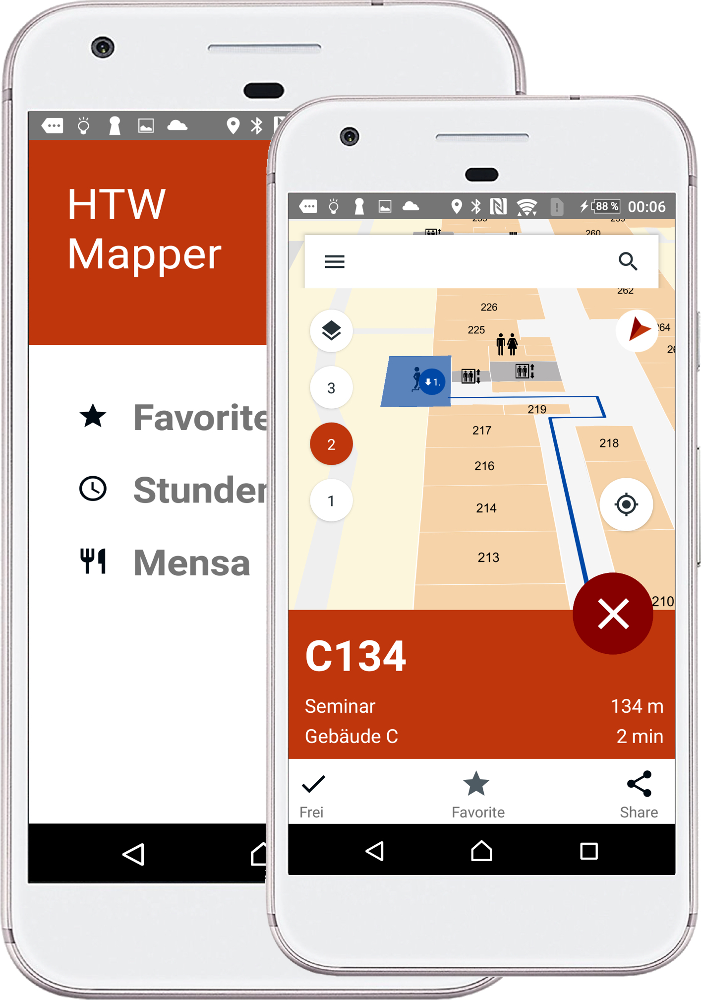

#    Campus indoor/ outdoor navigation 

Based on react native, we built up the first indoor/ outdoor navigation   
app, developed for the HTW Wilhelminenhof campus in Berlin.

### What's the deal?

Are you new as a student at the campus or just a visitor? This app will   
guide you! **Android only**

### How? I can use google maps!

With the help of **Indoor Atlas** we mapped all levels, so indoor   
positioning is accurate **up to 2 meters**. 
A magnetic field and wifi-signals from every router on the different levels makes the indoor positioning as accurate as it can be. You will need access to an **IndoorAtlas account**.

### What's the map like?

**Mapbox** serves. Within **Mapbox** we created our unique maps and   
adjust the styles, to the persons needs. 
The map is interactive and allows you to zoom in / zoom out, change the perspective (angle). Rooms are   
clickable and you can receive more information e.g. is this room occupied   
or free to use (if an API for this information is available), the room type and the building. You are also able to add this room to your   
favorites, to make a quick search. You will need access to a **Mapbox account**.

### Show me what you got!
As a user you will get everything you need to feel welcome and find everything you need. 
All features are listed below.

#### Search POIs

We integrated a search which can find any room you want to navigate to. You are able to find the room of 
your next lecture, the office of any professor and also points of interests e.g. changing rooms, printers, snacks & coffee machine.

#### Positioning and Routing

With a click on the navigation botton, it will take your actual position and navigate you to 
the place of choice, no matter if it's indoor or outdoor. Your position will be centered and 
the path will be displayed on the map on the same floor. You will also receive infromation 
about the estimated time and distance to travel. Depending on the settings of your choice, 
you will eighter take the lift or the stairs. A marker will show you where to get off and 
show you the way to your desired room.

#### Really, there is still more?

We want to have all features combined in one app, so we decided to add one more feature to the 
app. You are now up to date with the menue in the HTW Wilhelminenhof Berlin cafeteria.

*The integration of the students schedule is not yet implemented.*

### Build, deployment and system structure

[Build](./docs/build-and-deployment.md)

### Framework

[React Native](https://facebook.github.io/react-native/)

### External Libraries

[IndoorAtlas](http://www.indooratlas.com/) - *Account required*

[Mapbox](https://www.mapbox.com/) - *Account required*

### License

MIT License

### Contributors

[Johannes Brunner](https://github.com/jannesbrunner),
[Jonathan Derin](https://github.com/bbrinx),
[Georg Donner](https://github.com/georgdonner),
[Juliane Fink](https://github.com/SyJuly),
Franz Wegner,
[Christian Westphal](https://github.com/Ch-W3st)
